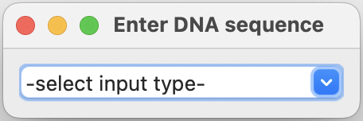
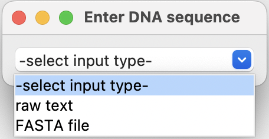
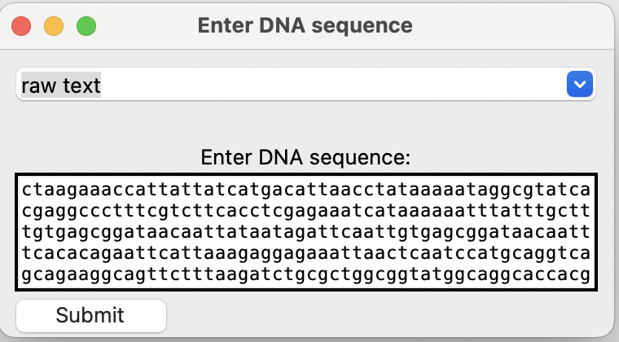
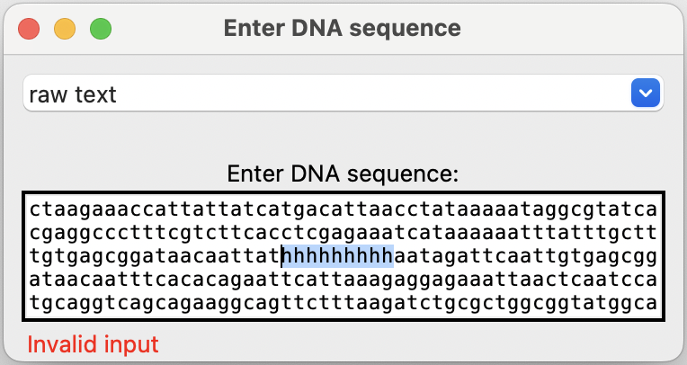
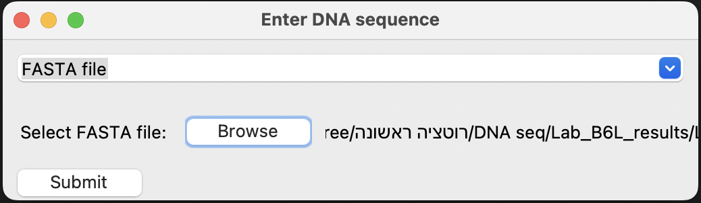
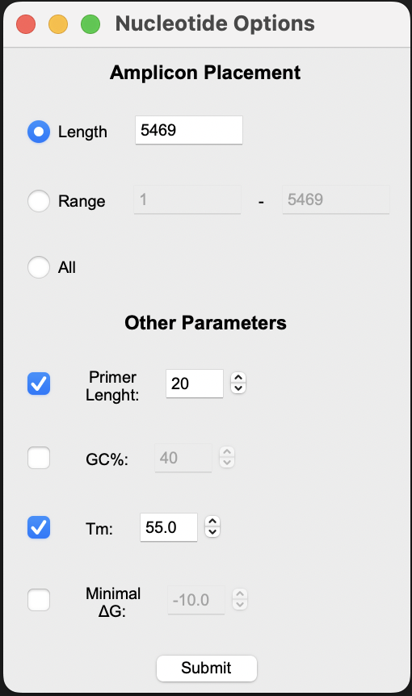
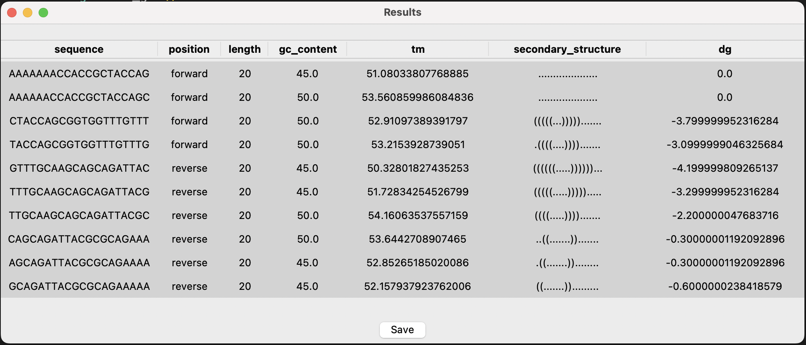

# Nadav Final Project

In my lab, we have encountered a problem where we need to design [PCR primers](https://www.youtube.com/watch?v=NODrmBHHni8&ab_channel=Henrik%27sLab), but the tools on the market these days are expensive, so the planning is done manually and inefficiently.

When planned manually, you need to select the sequence yourself and then analyze it using various online tools to get GC content, secondary structure, and [Primer dimer](https://kilobaser.com/the-pain-of-primer-dimer/), which will all have an effect on the PCR reaction efficiency.

I want to build a tool that will get a sequence and produce primers for that sequence.

In order to do so, I am using these libraries and modules:

- [Biopython](https://biopython.org/)
- [ViennaRNA Package 2](https://www.tbi.univie.ac.at/RNA/documentation.html#)
- Other standard packages like numpy and pandas

The application can be used to design primers for any DNA sequence, providing a comprehensive solution for primer design and analysis. The graphical user interface simplifies the process of entering sequence data and viewing the results, enhancing the user experience and productivity. The tool is designed to be intuitive and user-friendly, making it accessible to researchers and professionals involved in molecular biology and genetics.

The application is designed to be modular and extensible, allowing for the addition of new features and functionalities in the future. It can be integrated with other tools and platforms to enhance its capabilities and provide a more comprehensive solution for primer design and analysis. The codebase is well-documented and structured, making it easy to understand and maintain, and the application can be further optimized for performance and scalability.

For further information and explanation, please refer to the [documentation](documentation.md).

**Step 1**: Install all required packages, which include: [Biopython](https://biopython.org/), [ViennaRNA Package 2](https://www.tbi.univie.ac.at/RNA/documentation.html#), [tkinter](https://docs.python.org/3/library/tkinter.html), [pandas](https://pandas.pydata.org/pandas-docs/stable/getting_started/install.html).

```python
pip install biopython
pip install viennarna
pip install tk
pip install pandas
```

In some cases the packages clash or are undetected, to dill with these problem simply open a new python environment. In some cases this might not hekp and the re-installation of anaconda might be required.

**Step 2**: download python files: Main.py, Primerdesigner.py, GUI.py and place them in the same directory.

**Step 3**: Run the Main.py file using the command line or an IDE. After running the file the next window will open up:
<div align="center">
    
</div>
When pressing the dropdown menu, two options will show: raw text and uploading a FASTA file:
<div align="center">
    
</div>
Select one of the options.

**Step 4**: Enter the DNA sequence or upload a FASTA file to begin the analysis.

When "raw text" is selected, the next window will appear, enter a valid DNA sequence in the text box. A valid DNA sequence consists of A, T, G, C, and the program is **not** case-sensitive.
<div align="center">
    
</div>
When entering an invalid input, you won't be able to submit your sequence, and it will alert you that the sequence is invalid.
<div align="center">
    
</div>
If the "FASTA file" option is selected, the next window will appear:
<div align="center">
    
</div>
When pressing the "Browse" button, a file browser will open up, allowing the selection of .FASTA files only. 
After selecting a file, a "Submit" button will appear.

Pressing the "Submit" button will send the user to the next window.

**Step 5**: Customize primer design parameters.

The next window will appear with several parameters that are divided into two sections:

The first section is "Amplicon Placement." In this section, the user is asked to define what will be amplified by the primers. There are three options to select from:
- Length: will take the first nucleotide in the submitted to be the first in the amplified sequence, and the user can set how long it will be, meaning the value entered is the end nucleotide. The default is the sequence length.
- Range: Is similar to the length, but here the first nucleotide is defined by the user.
- All: this option will take the entire sequence and define it as the amplified region.

The second section is "Other Parameters." In this section, the primer parameters are defined. The default values appear in the inactive spin boxes, and the user can change them if needed by ticking the box next to the parameter.

The parameters are:
- Primer Length: the length of the primer, the default is 20.
- GC Content: the GC content of the primer, the default is 40%.
- Primer Tm: the melting temperature of the primer, the default is 55°C.
- ∆G: the free energy of the primer, the default is -10 kcal/mol.

<div align="center">
    
</div>

When done, press the "Submit" button and move to the next window.

**Step 6**: View primer design results.

The next window will show the results of the primer design, including the forward and reverse primers, their sequences, and the primer properties. The user can view the results and save them to a file for future reference.

<div align="center">
    
</div>


Testing the code was done with the test_Primerdesigner.py file, which contains a few tests that cover the relevant parts of the code. The tests were successful, and the code is ready for use.
to run the tests, simply run the test_Primerdesigner.py file with the command line or an IDE using pytest.